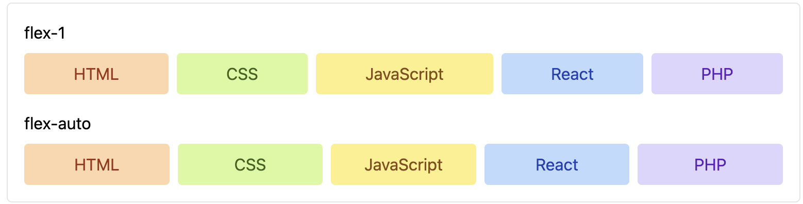
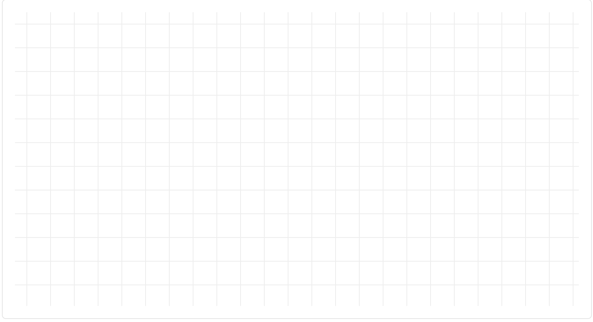
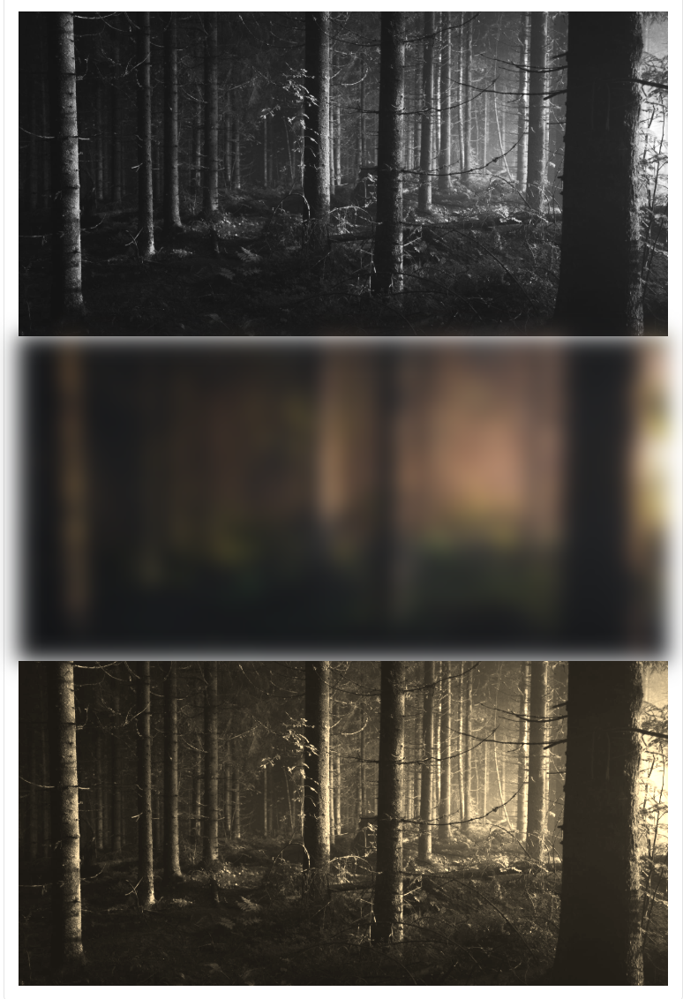
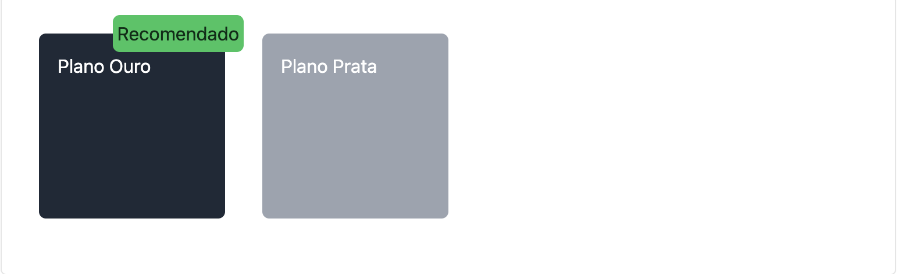

# Tailwind CSS v3.4.17

## Sobre

README criado com o objetivo de facilitar meus estudos e também ajudar quem estiver acessando este repositório.

O conteúdo foi amplamente baseado no curso da Origamid, com algumas adaptações feitas por mim para melhorar o entendimento.

Recomendo o curso do André em [origamid.com](https://www.origamid.com/) para quem deseja se aprofundar em front-end.

Para mais detalhes sobre a instalação oficial do Tailwind CSS, acesse a [documentação oficial](https://v3.tailwindcss.com/docs/installation).

## Requisitos

Para visualizar, editar e aproveitar melhor este repositório, é recomendado ter:

- [Visual Studio Code](https://code.visualstudio.com/)
- Extensão: [Tailwind CSS IntelliSense](https://marketplace.visualstudio.com/items?itemName=bradlc.vscode-tailwindcss)

# Instalação Tailwind v3.4.17

**Terminal**

```bash
npm install -D tailwindcss@3
npx tailwindcss init
```

**tailwind.config.js**

```bash
 /** @type {import('tailwindcss').Config} */
export default {
   content: ["./src/**/*.{html,js}"],
   theme: {
     extend: {},
   },
   plugins: [],
 }
```

**/src/input.css**

```bash
@tailwind base;
@tailwind components;
@tailwind utilities;
```

**Terminal**

```bash
npx @tailwindcss/cli -i ./src/input.css -o ./src/output.css --watch
```

**/src/index.html**

```bash
<!-- codigo -->
<!DOCTYPE html>
<html lang="pt-BR">
  <head>
    <meta charset="UTF-8" />
    <meta name="viewport" content="width=device-width, initial-scale=1.0" />
    <title>Tailwind CSS</title>
    <link href="./output.css" rel="stylesheet" />
  </head>
  <body>
    <h1 class="text-xl font-bold">Olá Mundo.</h1>
  </body>
</html>
```

# Box Model

## Width, Height e Size

```bash
<div class="bg-gray-300">Normal</div>
<div class="bg-gray-300 w-20 h-24">w-20 h-24</div>
<div class="bg-gray-300 size-32">size-32</div>
```

<p align="center">
  
</p>

# Básico de Cores

O Tailwind CSS possui uma paleta bem completa de cores. Todas elas possuem valores de 50 (claro) até 950 (escuro). Além de valores como white e black

As cores podem ser aplicadas a diferentes elementos como background bg-, color text-, border border- e outros.

```bash
<div class="bg-gray-900 text-gray-200">bg-gray-900 text-gray-200</div>
<div class="bg-red-600">bg-red-600</div>
<div class="bg-yellow-400">bg-yellow-400</div>
<div class="bg-green-300 text-green-950">bg-green-300 text-green-950</div>
<div class="bg-cyan-400 text-cyan-950">bg-cyan-400 text-cyan-950</div>
<div class="bg-indigo-800 text-white">bg-indigo-800 text-white</div>
```

<p align="center">  </p>

# Unidades

Em geral, as unidades são geradas de 4px em 4px, então w-2 = 8px e w-5 = 20px. O Tailwind traduz o px para rem.

Existem exceções. w-1/2 = 50%, w-full = 100% e w-px é 1px

```bash
<div class="bg-gray-300 w-24">HTML</div>
<div class="bg-gray-300 w-1/2">CSS</div>
```

<p align="center">  </p>

# Padding e Margin

p- para padding e m- para margin.

py- para top/bottom, px- para left/right.

pt- = top, pb- = bottom, pr- = right, pl- = left.

É possível ter valores negativos para margin, como -mt-10 e auto mx-auto

```bash
<div class="grid justify-items-start">
  <p class="bg-gray-300 p-8">p-8</p>
  <p class="bg-gray-400 mt-8 px-4 py-8">px-4 py-8</p>
  <p class="bg-gray-200 pb-12 -mt-4">pb-12 -mt-4</p>
  <p class="bg-gray-600 m-auto">m-auto</p>
</div>
```

<p align="center">  </p>

# Border

Os valores de border são especificados em px, então border-4 é 4px de borda. Os valores de bottom, top e etc são separados por -, por exemplo, border-b, e não borderb.

```bash
<div class="bg-gray-300 p-4 mb-4 border border-gray-800">
  border border-gray-800
</div>
<div class="bg-gray-300 p-4 mb-4 border-b-4 border-gray-800">
  border-b-4 border-gray-800
</div>
<div class="bg-gray-300 p-4 border-x-4 border-gray-800">
  border-x-4 border-gray-800
</div>
```

<p align="center">  </p>

# box-sizing

Diferente do HTML padrão, o Tailwind define os elementos com box-sizing: border-box;. Sendo assim, os valores de border e padding são absorvidos pelo valor do height e não somados ao mesmo.

Podemos mudar para o comportamento padrão com box-content

```bash
<div class="bg-gray-300 border-gray-800 mb-4 p-4 border-y-4 h-16 box-border">
  p-4 border-y-4 h-16 box-border
</div>
<div
  class="bg-gray-300 border-gray-800 mb-4 p-4 border-y-4 h-16 pt-8 box-content"
>
  p-4 border-y-4 h-16 pt-8 box-content
</div>
```

<p align="center">  </p>

# Valores Arbitrários

Use valores arbitrários com colchetes [] para aplicar qualquer valor CSS que não esteja disponível nas classes padrão do Tailwind CSS.

Um valor arbitrário que for constantemente utilizado, deve se transformar em uma classe utilitárias (configurações).

```bash
<div class="w-[45%] h-[200px] bg-[#a8f] pt-[calc(10%-20px)]">
  w-[45%] h-[200px] bg-[#a8f] pt-[calc(10%-20px)]
</div>
```

<p align="center">  </p>

## Diferentes Aplicações

Podemos usar calc, variáveis de css e mais nos valores arbitrários.

```bash
<style>
  html {
    --positivo: #2e0;
  }
</style>
<div class="w-[calc(50%-10px)] bg-[--positivo] ">
  w-[calc(50%-10px)] bg-[--positivo]
</div>
```

<p align="center">  </p>

## Espaços e Vírgulas

A classe no Tailwind não pode ter espaços, então para lidar com eles o usamos o **\_**. Você pode usar as vírgulas normalmente.

```bash
<div class="shadow-[0_2px_4px_2px_rgba(0,0,0,0.25)] p-4">
  shadow-[0_2px_4px_2px_rgba(0,0,0,0.25)] p-4
</div>
```

<p align="center">  </p>

# Grid

grid define o display como grid

grid-cols- - cria colunas de 1fr

grid-rows- - cria linhas de 1fr

gap-x-, gap-y- e gap- - define o gap

```bash
<div class="grid grid-cols-2 gap-x-4 gap-y-8">
  <div class="bg-gray-300 p-4">Item 1</div>
  <div class="bg-gray-300 p-4">Item 2</div>
  <div class="bg-gray-300 p-4">Item 3</div>
  <div class="bg-gray-300 p-4">Item 4</div>
</div>
```

<p align="center">  </p>

## Grid Arbitrário

A divisão padrão do grid utliza 1fr apenas, mas geralmente precisamos de uma composição diferente. Use valores arbitrários grid-cols-[1fr_2fr]

```bash
<div class="grid grid-cols-[minmax(0,300px)_1fr] gap-2 *:bg-gray-300 *:p-4">
  <div>minmax(0,300px)</div>
  <div>1fr</div>
</div>
```

<p align="center">  </p>

## Grid Item

Utilize col-span- e row-span- para controlar o espaçamento e o alcance dos itens.

```bash
<div class="grid grid-cols-3 gap-2 *:bg-gray-300 *:p-4">
  <div class="col-span-full">Item 1: col-span-full</div>
  <div class="col-span-2 row-span-2">Item 2: col-span-2 row-span-2</div>
  <div>Item 3</div>
  <div>Item 4</div>
</div>
```

<p align="center">  </p>

## Start e End

Utilize col-start- e col-end- para posicionar itens em um local específico do grid.

```bash
<div class="grid grid-cols-3 gap-2 *:bg-gray-300 *:p-4">
  <div class="col-start-2">Item 1: col-start-2</div>
  <div class="row-start-3 col-start-3">Item 2: row-start-3 col-start-3</div>
  <div>Item 3</div>
  <div>Item 4</div>
</div>
```

<p align="center">  </p>

# Flex

flex define o elemento como flexbox

flex-row e flex-row-reverse coloca em linha

flex-col e flex-col-reverse coloca em coluna

```bash
<ul class="flex gap-2 *:p-2 *:rounded *:text-center">
  <li class="bg-orange-200 text-orange-800">HTML</li>
  <li class="bg-lime-200 text-lime-800">CSS</li>
  <li class="bg-yellow-200 text-yellow-800">JavaScript</li>
  <li class="bg-blue-200 text-blue-800">React</li>
  <li class="bg-violet-200 text-violet-800">PHP</li>
</ul>
```

<p align="center">  </p>

## Flex Item

flex: (grow) (shrink) (basis)

flex-1: flex: 1 1 0%; Ocupa o espaço vazio, mas ignora o valor inicial do conteúdo

flex-auto: flex: 1 1 auto; Ocupa o espaço vazio, mas cresce de acordo com o tamanho inicial do conteúdo.

```bash
<h1 class="mb-2">flex-1</h1>
<ul class="flex *:flex-auto gap-2 *:p-2 *:rounded *:text-center mb-4">
  <li class="bg-orange-200 text-orange-800">HTML</li>
  <li class="bg-lime-200 text-lime-800">CSS</li>
  <li class="bg-yellow-200 text-yellow-800">JavaScript</li>
  <li class="bg-blue-200 text-blue-800">React</li>
  <li class="bg-violet-200 text-violet-800">PHP</li>
</ul>

<h1 class="mb-2">flex-auto</h1>
<ul class="flex *:flex-1 gap-2 *:p-2 *:rounded *:text-center">
  <li class="bg-orange-200 text-orange-800 p-2">HTML</li>
  <li class="bg-lime-200 text-lime-800 p-2">CSS</li>
  <li class="bg-yellow-200 text-yellow-800 p-2">JavaScript</li>
  <li class="bg-blue-200 text-blue-800 p-2">React</li>
  <li class="bg-violet-200 text-violet-800 p-2">PHP</li>
</ul>
```

<p align="center">  </p>

## Grow e Shrink

grow | grow-0: flex-grow: 1 | 0

shrink | shrink-0: flex-shrink: 1 | 0

```bash
<ul class="flex gap-2 *:p-2 *:rounded *:text-center">
  <li class="bg-orange-200 text-orange-800">HTML</li>
  <li class="bg-lime-200 text-lime-800 grow">CSS</li>
  <li class="bg-yellow-200 text-yellow-800 grow">JavaScript</li>
  <li class="bg-blue-200 text-blue-800 w-32 shrink-0">React</li>
  <li class="bg-violet-200 text-violet-800">PHP</li>
</ul>
```

<p align="center">  </p>

## Wrap

flex-wrap: flex-wrap: wrap;

flex-wrap-reverse: flex-wrap: wrap-reverse;

flex-nowrap: flex-wrap: nowrap;

```bash
<ul class="flex gap-2 flex-wrap  *:flex-1 w-60 *:p-2 *:rounded *:text-center">
  <li class="bg-orange-200 text-orange-800">HTML</li>
  <li class="bg-lime-200 text-lime-800">CSS</li>
  <li class="bg-yellow-200 text-yellow-800">JavaScript</li>
  <li class="bg-blue-200 text-blue-800">React</li>
  <li class="bg-violet-200 text-violet-800">PHP</li>
</ul>
```

<p align="center">  </p>

# Align/Justify Items

items- (align) alinha os itens no eixo Y (vertical)

justify-items- justifica os itens no eixo X (horizontal)

place-items- alinha/justifica os itens

start, center, end, stretch

Observação: O alinhamento/justificação só funciona quando existe espaço vazio para alinhar.

```bash
<section
  class="items-center justify-items-end h-96 grid grid-cols-2 gap-4 bg-[url('./img/grid.svg')]"
>
  <div class="bg-violet-900 p-8 rounded">
    <h2 class="font-bold mb-4 text-white">Plano Premium</h2>
    <ul class="list-disc text-white">
      <li>300 Acessos</li>
      <li>1200 Requests</li>
      <li>Suporte Vitalício</li>
      <li>Acesso Completo</li>
      <li>Proteção Total</li>
    </ul>
    <button class="bg-violet-200 text-violet-900 py-1 px-4 rounded mt-4">
      Assinar Premium
    </button>
  </div>
  <div class="bg-gray-200 p-8 rounded">
    <h2 class="font-bold mb-4">Plano Básico</h2>
    <ul class="list-disc">
      <li>150 Acessos</li>
      <li>500 Requests</li>
    </ul>
    <button class="bg-gray-300 text-gray-900 py-1 px-4 rounded mt-4">
      Assinar Básico
    </button>
  </div>
</section>
```

<p align="center">  </p>

## Align/Justify Self

self- (align) alinha o item no eixo Y (vertical)

justify-self- justifica o item no eixo X (horizontal)

place-self- alinha/justifica o item

start, center, end, stretch

Observação: O alinhamento/justificação só funciona quando existe espaço vazio para alinhar.

```bash
<section class="h-96 grid grid-cols-2 gap-4 bg-[url('./img/grid.svg')]">
  <div class="bg-violet-900 p-8 rounded self-end justify-self-start">
    <h2 class="font-bold mb-4 text-white">Plano Premium</h2>
    <ul class="list-disc text-white">
      <li>300 Acessos</li>
      <li>1200 Requests</li>
      <li>Suporte Vitalício</li>
      <li>Acesso Completo</li>
      <li>Proteção Total</li>
    </ul>
    <button class="bg-violet-200 text-violet-900 py-1 px-4 rounded mt-4">
      Assinar Premium
    </button>
  </div>
  <div class="bg-gray-200 p-8 rounded place-self-center">
    <h2 class="font-bold mb-4">Plano Básico</h2>
    <ul class="list-disc">
      <li>150 Acessos</li>
      <li>500 Requests</li>
    </ul>
    <button class="bg-gray-300 text-gray-900 py-1 px-4 rounded mt-4">
      Assinar Básico
    </button>
  </div>
</section>
```

<p align="center">  </p>

## Align/Justify Content

content- (align) alinha o conteúdo no eixo Y (vertical)

justify- justifica o conteúdo no eixo X (horizontal)

place-content alinha/justifica o conteúdo

start, center, end, stretch, normal, between, around

```bash
<section class="flex h-96 gap-4 bg-[url('./img/grid.svg')] justify-center">
  <div class="bg-violet-900 p-8 rounded">
    <h2 class="font-bold mb-4 text-white">Plano Premium</h2>
    <ul class="list-disc text-white">
      <li>300 Acessos</li>
      <li>1200 Requests</li>
      <li>Suporte Vitalício</li>
      <li>Acesso Completo</li>
      <li>Proteção Total</li>
    </ul>
    <button class="bg-violet-200 text-violet-900 py-1 px-4 rounded mt-4">
      Assinar Premium
    </button>
  </div>
  <div class="bg-gray-200 p-8 rounded content-end">
    <h2 class="font-bold mb-4">Plano Básico</h2>
    <ul class="list-disc">
      <li>150 Acessos</li>
      <li>500 Requests</li>
    </ul>
    <button class="bg-gray-300 text-gray-900 py-1 px-4 rounded mt-4">
      Assinar Básico
    </button>
  </div>
</section>
```

<p align="center">  </p>

```bash
<section
  class="grid grid-cols-[auto_auto] h-96 gap-4 bg-[url('./img/grid.svg')] place-content-center"
>
  <div class="bg-violet-900 p-8 rounded">
    <h2 class="font-bold mb-4 text-white">Plano Premium</h2>
    <ul class="list-disc text-white">
      <li>300 Acessos</li>
      <li>1200 Requests</li>
      <li>Suporte Vitalício</li>
      <li>Acesso Completo</li>
      <li>Proteção Total</li>
    </ul>
    <button class="bg-violet-200 text-violet-900 py-1 px-4 rounded mt-4">
      Assinar Premium
    </button>
  </div>
  <div class="bg-gray-200 p-8 rounded">
    <h2 class="font-bold mb-4">Plano Básico</h2>
    <ul class="list-disc">
      <li>150 Acessos</li>
      <li>500 Requests</li>
    </ul>
    <button class="bg-gray-300 text-gray-900 py-1 px-4 rounded mt-4">
      Assinar Básico
    </button>
  </div>
</section>
```

<p align="center">  </p>

# Rounded e Max

## Rounded

rounded / -sm, -xl ... -full - border-radius

rounded-e / s / t / b - end / start / top / bottom

```bash
<button class="bg-gray-300 border-2 border-gray-800 px-4 py-2 mb-4 rounded">
  Comprar Produto
</button>
<br />
<button
  class="bg-gray-300 border-2 border-gray-800 px-4 py-2 mb-4 rounded-e-2xl"
>
  Comprar Produto
</button>
<br />
<button
  class="bg-gray-300 border-2 border-gray-800 px-4 py-2 mb-4 rounded-full"
>
  Comprar Produto
</button>
```

<p align="center">  </p>

## max-w

Utilize o max-w para controlar o tamanho máximo de width de elementos de bloco/grid/flex

A escala possui, além dos valores de 4px em 4px, medidas predefinidas como sm / lg / xl e screen-sm / screen-lg

```bash
<h1 class="max-w-40 mx-auto bg-purple-200 text-center">
  Cursos de Front End & UI Design
</h1>
<h1 class="max-w-40 mx-auto bg-purple-200 text-center">
  Cursos de Front End & UI Design
</h1>
<div class="h-8 bg-blue-200 max-w-40">max-w-40 (160px)</div>
<div class="h-8 bg-lime-200 max-w-sm">max-w-sm (384px)</div>
<div class="h-8 bg-red-200 max-w-lg">max-w-lg (512px)</div>
<div class="h-8 bg-yellow-200 max-w-screen-lg">max-w-screen-lg (1024px)</div>
```

<p align="center">  </p>

# Display

block / inline / inline-block - display: block

grid / flex / inline-flex / inline-grid - display: grid

```bash
<a href="/" class="bg-blue-200 py-2 px-4 inline">Contato</a>
<a href="/" class="bg-blue-200 py-2 px-4 inline-block">Sobre</a>
<p class="bg-purple-200 py-2 px-4">Saiba Mais</p>
```

<p align="center">  </p>

## Hidden e Invisible

hidden - display: none;

invisible - visibility: hidden;

```bash
<nav>
  <button id="menuButton" class="bg-purple-300 px-4 py-2">Menu</button>
  <ul id="menu" class="hidden">
    <li>Produtos</li>
    <li>Sobre</li>
    <li>Contato</li>
  </ul>
</nav>

<script>
  menuButton?.addEventListener('click', () => {
    menu?.classList.toggle('hidden');
  });
</script>
```

<p align="center">  </p>

Pressionado

<p align="center">  </p>

## sr-only

sr-only e not-sr-only

É uma classe utilitária que esconde o elemento da tela, mas mantém ele disponível para leitores de tela.

Exemplo

```bash
<a href="#principal" class="sr-only focus:not-sr-only">Pular para o conteúdo</a>
<nav>
  <ul class="mb-96 flex gap-4">
    <li><a href="/">Produtos</a></li>
    <li><a href="/">Sobre</a></li>
    <li><a href="/">Contato</a></li>
  </ul>
</nav>

<main id="principal">
  <h1>Notebooks e Smartphones</h1>
</main>
```

<p align="center">  </p>

# Position

absolute / relative / sticky / fixed - position

```bash
<nav class="flex justify-between bg-gray-200 p-4 sticky top-0">
  <a href="/">Floresta</a>
  <ul class="flex gap-4">
    <li><a href="/">Produtos</a></li>
    <li><a href="/">Sobre</a></li>
    <li><a href="/">Contato</a></li>
  </ul>
</nav>
<p class="my-96 h-96">Conteúdo</p>
```

sticky aplica a propriedade CSS position: sticky, que faz com que um elemento fique fixo dentro do seu contêiner pai ao rolar a página, até certo ponto.

<p align="center">  </p>

## top/right/bottom/left

top / right / bottom / left - valores positivos e negativos

z-0 / 10 ... 50 - z-index

```bash
<div class="flex gap-4">
  <div class="bg-lime-950 h-20 w-20 rounded relative">
    <div
      class="bg-lime-300 border-4 border-lime-950 h-3 w-12 rounded-full absolute top-8 -right-8 z-10"
    ></div>
  </div>
  <div class="bg-lime-950 h-20 w-20 rounded relative"></div>
</div>
```

<p align="center">  </p>

## inset

inset / inset-x - define valores para top/right/bottom/left

```bash
<div class="size-40">Conteúdo</div>
<div class="absolute inset-0 bg-black/50 z-50">Overlay</div>
```

<p align="center">  </p>

# Cores e Tipografia

## Cores,

As cores vão de 50 (claro) - 950 (escuro).

O Tailwind oferece diferentes tons de cinza (gray, neutral, stone, ...) e diferentes matizes (green, lime, emerald, ...).

Tem também o white e black

https://tailwindcss.com/docs/customizing-colors

```bash
<div class="grid grid-cols-3">
  <div>
    <div class="bg-blue-100">bg-blue-100</div>
    <div class="bg-blue-500">bg-blue-500</div>
    <div class="bg-blue-900">bg-blue-900</div>
  </div>
  <div>
    <div class="bg-lime-100">bg-lime-100</div>
    <div class="bg-lime-500">bg-lime-500</div>
    <div class="bg-lime-900">bg-lime-900</div>
  </div>
  <div>
    <div class="bg-yellow-100">bg-yellow-100</div>
    <div class="bg-yellow-500">bg-yellow-500</div>
    <div class="bg-yellow-900">bg-yellow-900</div>
  </div>
</div>
```

<p align="center">  </p>

## Cinza

Os tons de cinza variam em suas matizes: o cinza padrão apresenta um leve tom azul, o stone tem uma tonalidade avermelhada e o neutral permanece completamente neutro.

```bash
<div class="grid grid-cols-3">
  <div>
    <div class="bg-gray-100">bg-gray-100</div>
    <div class="bg-gray-500">bg-gray-500</div>
    <div class="bg-gray-900">bg-gray-900</div>
  </div>
  <div>
    <div class="bg-neutral-100">bg-neutral-100</div>
    <div class="bg-neutral-500">bg-neutral-500</div>
    <div class="bg-neutral-900">bg-neutral-900</div>
  </div>
  <div>
    <div class="bg-stone-100">bg-stone-100</div>
    <div class="bg-stone-500">bg-stone-500</div>
    <div class="bg-stone-900">bg-stone-900</div>
  </div>
</div>
```

<p align="center">  </p>

## Contraste

400- - Cores mais claras.

600+ - Cores mais escuras.

Cuidado com as cores do meio 400 -> 600, pois elas possuem menores possibilidades de fundos contrastantes.

O Tailwind não possui uma lógica de contraste, uma matiz que funciona bem com 300/600 pode não funcionar em outra.

Por regra, tente usar cores com diferença de pelo menos 500 pontos.

```bash
<div class="grid grid-cols-3 gap-4 *:p-4 text-sm">
  <div class="bg-lime-200 text-lime-600">Lime 200/600 - 2.65:1</div>
  <div class="bg-blue-200 text-blue-600">Lime 200/600 - 3.64:1</div>
  <div class="bg-neutral-200 text-neutral-600">Neutral 200/600 - 6.20:1</div>
  <div class="bg-lime-200 text-lime-800">Lime 200/800 - 6.06:1</div>
  <div class="bg-blue-200 text-blue-800">Lime 200/800 - 6.14:1</div>
  <div class="bg-neutral-200 text-neutral-800">Neutral 200/800 - 12.01:1</div>
</div>
```

<p align="center">  </p>

## Propriedades

Praticamente todas as propriedades que permitem a alteração de cores podem utilizar as paletas de cores do Tailwind.

text-, bg-, border-, decoration- e outros

```bash
<div
  class="decoration-purple-800 text-purple-800 decoration-2 underline underline-offset-2"
>
  Origamid
</div>
```

<p align="center">  </p>

## Opacidade

Podemos modificar a opacidade de uma cor adicionando / e a porcentagem que desejamos: bg-black/20 vai gerar rgb(0 0 0 / 0.2);

Os valores vão de 0 até 100, pulando de 5 em 5.

```bash
<div class="size-28 bg-blue-500/50"></div>
<div class="size-28 bg-red-500/50 -mt-6"></div>
<div class="size-28 bg-green-500/50 -mt-6"></div>
```

<p align="center">  </p>

## Cores Arbitrárias

Podemos utilizar valores arbitrários para cores, mas geralmente vamos definir nas configurações uma nova cor. Pois assim o Tailwind gera para a gente todas as cores com o novo valor.

```bash
<div
  class="bg-[#333] text-[color(display-p3_1_0.9_0)] border-[hsl(20_80%_60%)] border-4"
>
  Front End
</div>
```

<p align="center">  </p>

## Escala Tipográfica

text-xs / sm / lg / xl / 2xl ... 9xl - font-size

```bash
<p class="text-xs">Escala tipográfica - text-xs</p>
<p class="text-sm">Escala tipográfica - text-sm</p>
<p class="text-base">Escala tipográfica - text-base</p>
<p class="text-lg">Escala tipográfica - text-lg</p>
<p class="text-xl">Escala tipográfica - text-xl</p>
<p class="text-2xl">Escala tipográfica - text-2xl</p>
<p class="text-5xl">Escala tipográfica - text-5xl</p>
```

<p align="center">  </p>

## Font

Define estilo e peso.

font-serif / sans / mono - font-family

font-bold / light / medium / black - font-weight

italic - font-style

```bash
<h1 class="text-2xl font-serif font-bold mb-4">Aurora Boreal</h1>
<p class="text-lg font-mono">
  Descubra o melhor período para observar a deslumbrante Aurora Boreal, com o
  céu iluminado por milhares de estrelas. Desperte ao som dos pássaros e
  participe das nossas caminhadas ao ar livre para viver essa experiência
  mágica.
</p>
```

<p align="center">  </p>

## Text

text-left / center / right - text-align

text-balance / pretty / nowrap - text-wrap

uppercase / lowercase / capitalize - text-transform

```bash
<h1 class="font-serif font-bold text-3xl text-center uppercase">
  Aurora Boreal
</h1>
<p class="text-lg w-96 mt-4 mx-auto text-center">
  Descubra o melhor período para observar a deslumbrante Aurora Boreal, com o
  céu iluminado por milhares de estrelas. Desperte ao som dos pássaros e
  participe das nossas caminhadas ao ar livre para viver essa experiência
  mágica.
</p>
```

<p align="center">  </p>

## Leading e Tracking

leading-normal / none / relaxed / 3 ... 10 - line-height

text-xl/relaxed - font-size + line-height

tracking-wide / tight - letter-spacing

```bash
<h1 class="font-serif font-bold text-xl text-center tracking-wide uppercase">
  Aurora Boreal
</h1>
<p class="text-sm/relaxed w-96 mt-4 italic mx-auto text-center text-balance">
  Descubra o melhor período para observar a deslumbrante Aurora Boreal, com o
  céu iluminado por milhares de estrelas. Desperte ao som dos pássaros e
  participe das nossas caminhadas ao ar livre para viver essa experiência
  mágica.
</p>
```

<p align="center">  </p>

## Underline

underline / line-through / no-underline - text-decoration

underline-offset-2 - text-underline-offset

decoration-gray-200 - text-decoration-color

decoration-0 / 2 ... 8 - text-decoration-thickness

decoration-dashed / wavy / dotted - text-decoration-style

```bash
<a
  class="text-xl underline underline-offset-4 decoration-wavy decoration-4 decoration-purple-600"
>
  Inscreva-se
</a>
```

<p align="center">  </p>

## Background

bg-gray-200 - background-color

bg-[url('img/padrao.svg')] - valor arbitrário para usar imagens

```bash
<div class="h-96 bg-[url('./img/padrao.svg')]"></div>
```

<p align="center">  </p>

## Propriedades

bg-cover / contain - background-size

bg-no-repeat - background-repeat

bg-center / top / right / left - background-position

bg-fixed / scroll - background-attachment

```bash
<div
  class="p-12 pt-60 rounded-2xl overflow-hidden bg-[url('img/floresta.jpg')] bg-fixed bg-center bg-no-repeat bg-cover"
>
  <h1
    class="text-4xl/tight text-white font-serif font-bold text-balance mb-16 max-w-screen-sm"
  >
    Venha Experimentar a Vida na Floresta
  </h1>
  <p class="text-white">
    Melhores locais para visitar
    <a
      href="/"
      class="underline underline-offset-4 decoration-2 inline-block text-white"
      >2049</a
    >*
  </p>
</div>
```

<p align="center">  </p>

## Clip

bg-clip-text - background-clip

```bash
<h1
  class="text-4xl/tight bg-clip-text text-transparent bg-[url('img/floresta.jpg')] font-serif font-bold text-balance"
>
  Venha Experimentar a Vida na Floresta
</h1>
```

<p align="center">  </p>

## Filtros

Os filtros são aplicados utilizando a propriedade filter.

```bash


```

<p align="center">  </p>

## Backdrop Filter

Os mesmos filtros podem também ser aplicados aos elementos do fundo apenas. Lembrando que para ver os elementos do fundo, é necessário que o elemento no topo possua uma certa transparência.

backdrop-blur-md - backdrop-filter

```bash
<nav
  class="bg-white/30 absolute top-20 left-20 p-4 w-40 rounded-md backdrop-blur-md"
>
  <a href="">Home</a>
  <ul>
    <li>Produtos</li>
    <li>Sobre</li>
    <li>Contato</li>
  </ul>
</nav>

```

<p align="center">  </p>

## Pseudo Classes

Podemos utilizar pseudo classes como hover: e active: para adicionarmos classes condicionais.

hover:bg-green-200 - o background só será verde ao hover

```bash
<button
  class="bg-blue-400 hover:bg-blue-200 active:bg-blue-300 text-blue-950 border-2 border-blue-200 rounded-md py-2 px-4"
>
  Comprar Produto
</button>
```

<p align="center">  </p>

Hover

<p align="center">  </p>

## Focus, Visited e Disabled

focus: - foco do teclado

visited: - link visitado

disabled: - campo/botão desabilitado

hover:disabled: - campo/botão desabilitado e com hover

```bash
<input
  class="border-2 border-gray-200 bg-gray-100 rounded-md p-2 focus:outline-yellow-400"
  type="text"
/>
<button
  class="bg-blue-400 hover:bg-blue-200 active:bg-blue-300 text-blue-950 border-2 border-blue-200 rounded-md py-2 px-4 hover:disabled:bg-blue-400 disabled:grayscale disabled:opacity-50"
  disabled
>
  Enviar
</button>
```

<p align="center">  </p>

## Seletores

first: - first-child

last: - last-child

odd: - nth-child(odd)

even: - nth-child(even)

Importante, esse tipo de seletor deve ser adicionado diretamente aos filhos. No CSS usamos ul li:first-child - note que estamos adicionando no LI e não na UL o :first-child. Logo terá que ser assim também no Tailwind, não coloque odd: na ol/ul, mas sim na li

```bash
<!-- O código abaixo fará mais sentido quando utilizamos JavaScript ou Back End para gerar o conteúdo através de um Loop, onde não sabemos exatamente qual o primeiro/último elemento -->
<ol class="list-decimal m-4">
  <li class="odd:bg-gray-200 first:text-green-600 last:text-red-600">Marta</li>
  <li class="odd:bg-gray-200 first:text-green-600 last:text-red-600">Nina</li>
  <li class="odd:bg-gray-200 first:text-green-600 last:text-red-600">Maria</li>
  <li class="odd:bg-gray-200 first:text-green-600 last:text-red-600">Mara</li>
  <li class="odd:bg-gray-200 first:text-green-600 last:text-red-600">Mila</li>
</ol>
```

<p align="center">  </p>

## Asterisco

_: Seleciona os filhos com > _

```bash
<ol
  class="list-decimal m-4 *:p-2 odd:*:bg-gray-200 last:*:text-red-600 first:*:text-green-600"
>
  <li>Marta</li>
  <li>Nina</li>
  <li>Maria</li>
  <li>Mara</li>
  <li>Mila</li>
</ol>
```

<p align="center">  </p>

## Before e After

Adiciona os pseudo elements before e after.

O Tailwind adiciona content: '' automaticamente.

```bash
<button
  class="bg-blue-400 hover:bg-blue-200 active:bg-blue-300 text-blue-950 border-2 border-blue-200 rounded-md py-2 px-4 relative after:size-6 after:bg-white after:border-4 after:border-blue-900 after:border-r-transparent after:rounded-full after:absolute after:-top-2 after:-right-2"
>
  Comprar Produto
</button>
```

<p align="center">  </p>

## Evite

Considere uma div/span para a criação de elementos decorativos, assim evitamos poluir a tag com classes de before e after.

```bash
<button
  class="bg-blue-400 hover:bg-blue-200 active:bg-blue-300 text-blue-950 border-2 border-blue-200 rounded-md py-2 px-4 relative"
>
  Comprar Produto
  <span
    class="size-6 bg-white border-4 border-blue-900 border-r-transparent rounded-full absolute -top-2 -right-2"
  ></span>
</button>
```

<p align="center">  </p>

## Outros

placeholder - estiliza o placeholder de inputs

marker - estiliza marcadores de lista

https://tailwindcss.com/docs/hover-focus-and-other-states#pseudo-elements

```bash
<input
  type="text"
  class="border-2 rounded-md border-gray-400 p-2 placeholder:text-gray-500"
  placeholder="Email"
/>
<ul class="list-disc mt-8 marker:text-green-400">
  <li>Produto 1</li>
  <li>Produto 2</li>
  <li>Produto 3</li>
</ul>
```

<p align="center">  </p>

# Responsividade

O Tailwind possui modificadores que aplicam as propriedades de acordo com o media querie.

Ele é Mobile First, logo uma propriedade md:text-4xl será aplicada quando a tela for maior que 768px já text-2xl será aplicado em qualquer tamanho de tela.

Breakpoints nativos, aplicam o @media (min-width: px):

sm: 640px

md: 768px

lg: 1024px

xl: 1280px

2xl: 1536px

```bash
<!-- acima de md - 768px - aplica text-4xl -->
<h1 class="text-xl md:text-4xl font-bold font-serif">
  Venha Experimentar a Vida na Floresta
</h1>
```

<p align="center">  </p>

768px >

<p align="center">  </p>

## max-

É possível também usar o modificador max-md: para aplicar os estilos quando a tela for menor que md (768px).

Tamanhos disponíveis: sm, md, lg, xl, 2xl.

```bash
<div class="grid grid-cols-2 max-md:grid-cols-1 gap-8">
  <div class="h-20 bg-green-400 rounded-md"></div>
  <div class="h-20 bg-green-400 rounded-md"></div>
</div>
```

<p align="center">  </p>

768px >

<p align="center">  </p>

## min-[] e max-[]

Valor arbitrário é possível com o min-[]: e max-[]:

```bash
<div
  class="h-20 rounded-md bg-green-400 max-[600px]:bg-red-400 min-[700px]:bg-yellow-400"
></div>
```

<p align="center">  </p>

600px >

<p align="center">  </p>

# dark:

O modificador dark: serve para aplicarmos estilos diferentes quando o usuário prefere o dark-mode.

```bash
<div class="rounded-md max-w-md p-4 bg-neutral-200 dark:bg-neutral-800">
  <h1
    class="text-xl font-serif font-bold mb-2 text-neutral-500 dark:text-neutral-200"
  >
    Aurora Boreal
  </h1>
  <p class="text-neutral-700 dark:text-neutral-300">
    Melhor período para observação da Aurora Boreal, o céu estará iluminado
    pelas estrelas.
  </p>
</div>
```

<p align="center">  </p>

## group

No CSS podemos colocar uma pseudo-class no pai e alterar o filho.

No Tailwind podemos utilizar um modificador group para termos o mesmo efeito.

group deve ser adicionado ao elemento pai

group-modificador: deve ser adicionado ao elemento filho que será alterador quando o modificador ocorrer no pai.

```bash
/* exemplo do que é possível no css */
.item:hover h1 {
}
.item:hover p {
}
```

```bash
<div class="rounded-md max-w-md p-4 bg-neutral-200 hover:bg-neutral-800 group">
  <h1
    class="text-xl font-serif font-bold mb-2 text-neutral-500 group-hover:text-neutral-200"
  >
    Aurora Boreal
  </h1>
  <p class="text-neutral-700 group-hover:text-neutral-300">
    Melhor período para observação da Aurora Boreal, o céu estará iluminado
    pelas estrelas.
  </p>
</div>
```

<p align="center">  </p>

Hover

<p align="center">  </p>

## peer

Funciona como o group porém serve para elementos "irmãos", que estão dentro do mesmo pai e no mesmo nível.

```bash
<form action="">
  <div>
    <input
      type="text"
      class="border-2 border-gray-200 peer p-2"
      placeholder="cpf"
    />
    <p class="invisible peer-focus:visible text-yellow-700 mb-2">
      Use pontos e hífen
    </p>
  </div>
  <div>
    <input type="email" class="border-2 border-gray-200 peer p-2" />
    <p class="invisible peer-invalid:visible text-red-800">Email inválido.</p>
  </div>
  <div>
    <label for="seguros" class="flex gap-2 peer">
      <input id="seguros" name="seguros" type="checkbox" />
      Seguros
    </label>
    <p class="invisible peer-has-[:checked]:visible mb-2">
      Você estará segurado até 24/12/2049
    </p>
  </div>
  <button class="border-2 border-gray-200 rounded-md p-2">Enviar</button>
</form>
```

<p align="center">  </p>

## has

Verifica se existe algum filho com a condição entre colchetes has-[]

```bash
<div class="flex gap-8 mb-4 p-4">
  <div
    class="has-[.recomendado]:bg-gray-800  bg-gray-400 p-4 rounded-md size-40 relative"
  >
    <h2 class="text-white">Plano Ouro</h2>
    <div
      class="recomendado absolute bg-green-500 text-green-950 p-1 rounded-md -top-4 -right-4"
    >
      Recomendado
    </div>
  </div>
  <div
    class="has-[.recomendado]:bg-gray-800 bg-gray-400 p-4 rounded-md size-40 relative"
  >
    <h2 class="text-white">Plano Prata</h2>
  </div>
</div>
```

<p align="center">  </p>

# Efeitos

## Sombra

O Tailwind oferece alguns valores padrões para sombras e permite também mudarmos a cor delas com shadow-cor

```bash
<div class="flex gap-4">
  <div class="size-40 bg-white shadow-md"></div>
  <div class="size-40 bg-white shadow-xl"></div>
  <div class="size-40 bg-white shadow-2xl shadow-blue-200"></div>
</div>
```

<p align="center">  </p>

## Ring

ring é uma sombra utilizada para simular uma borda nos elementos. Com ela podemos criar efeitos de bordas duplas, geralmente utilizados em botões e campos de input.

```bash
<input
  type="text"
  class="py-2 px-4 focus:ring-2 border border-gray-200 focus:border-yellow-500 ring-yellow-200 rounded-md focus:outline-none bg-gray-200 focus:bg-white"
/>
```

<p align="center">  </p>

# Transform

## translate

translate-x- - transform: translate(x,y)

translate-y- - transform: translate(x,y)

```bash
<div class="absolute size-20 bg-blue-500"></div>
<div class="absolute size-20 bg-yellow-500 translate-x-4 translate-y-8"></div>

<div class="size-32"></div>
```

<p align="center">  </p>

## rotate

rotate-45 - transform: rotate(45deg)

1, 2, 45, 90, 180

```bash
<div class="absolute size-20 bg-blue-500"></div>
<div class="absolute size-20 bg-yellow-500 rotate-45"></div>

<div class="size-32"></div>
```

<p align="center">  </p>

## scale

scale-50 - transform: scale(0.5)

scale-105 - transform: scale(1.05)

Tem scale-y e scale-x para escalar em um eixo apeans.

```bash
<div class="absolute size-20 bg-blue-500 scale-105"></div>
<div class="absolute size-20 bg-yellow-500 scale-50"></div>

<div class="size-32"></div>
```

<p align="center">  </p>

## origin

origin-center / top / bottom / left / right - transform-origin: center

```bash
<div class="absolute size-20 bg-red-500 rotate-12 origin-top-left"></div>
<div class="absolute size-20 bg-purple-500 rotate-6 origin-top-left"></div>
<div class="absolute size-20 bg-blue-500"></div>
<div class="absolute size-20 bg-yellow-500 scale-50 origin-top-left"></div>

<div class="size-32"></div>
```

<p align="center">  </p>

## transition

Anima as propriedades mais comuns como color / transform.

Usa uma duração de 150ms e uma transição com cubic-bezier.

transition / -all / -transform / -colors / -none

```bash
.transition {
  transition-property: color, background-color, border-color,
    text-decoration-color, fill, stroke, opacity, box-shadow, transform, filter,
    backdrop-filter;
  transition-timing-function: cubic-bezier(0.4, 0, 0.2, 1);
  transition-duration: 150ms;
}
```

```bash
<button
  class="bg-blue-200 hover:bg-blue-700 hover:text-white hover:scale-105 border-2 border-blue-700 px-4 py-2 rounded-md transition"
>
  Comprar Produto
</button>
```

<p align="center">  </p>

Hover com transition

<p align="center">  </p>

## propriedades

duration-300 / 150 / 500 - transition-duration:

ease-linear / in / out / in-out - transition-timing-function:

delay-0 / 300 / 1000 - transition-delay:

```bash
<button
  class="bg-blue-200 hover:bg-blue-700 hover:text-white hover:scale-105 border-2 border-blue-700 px-4 py-2 rounded-md transition duration-300 ease-out"
>
  Comprar Produto
</button>
<div class="m-4"></div>
<button
  class="bg-blue-200 hover:bg-blue-700 hover:text-white hover:scale-105 border-2 border-blue-700 px-4 py-2 rounded-md transition "
>
  Comprar Produto
</button>
```

<p align="center">  </p>

Com transition e duration no primeiro botão

<p align="center">  </p>

# motion-reduce

Para usuário que preferem utilizar aplicativos sem animações/movimentos.

motion-reduce:

```bash
<button
  class="bg-blue-200 hover:bg-blue-700 hover:text-white hover:scale-105 border-2 border-blue-700 px-4 py-2 rounded-md transition motion-reduce:transition-none motion-reduce:hover:scale-100"
>
  Comprar Produto
</button>
```

# Animações

## animate-spin

Anima o rotate do elemento.

```bash
<button
  class="bg-green-200 text-green-800 py-2 px-4 rounded-md flex items-center gap-2"
>
  COMPRAR
  <span
    class="block size-4 rounded-full border-4 border-green-600 border-r-transparent animate-spin"
  ></span>
</button>
```

<p align="center">
  
</p>

## animate-ping

Aumenta e remove a opacidade do elemento, usado em notificações.

```bash
<button class="bg-blue-200 text-blue-800 py-2 px-4 rounded-md relative">
  Mensagens
  <span class="size-3 bg-purple-600 rounded-full absolute -top-0.5 -right-0.5">
    <span
      class="size-3 absolute inset-0 bg-purple-600 rounded-full animate-ping"
    ></span>
  </span>
</button>
```

<p align="center">
  
</p>

# Gradiente

bg-gradient-to-b / t / tr / tl / br / bl

from- e to-

```bash
<button
  class="bg-gradient-to-b from-lime-600 to-lime-700 text-white py-2 px-4 rounded-md"
>
  COMPRAR
</button>
```

<p align="center">  </p>

## Via

via- para adicionar cores entre o from/to

```bash
<div
  class="h-1 mb-2 bg-gradient-to-r from-pink-400 via-red-400 to-blue-400"
></div>
<h1
  class="font-bold text-4xl text-transparent bg-clip-text bg-gradient-to-r from-pink-400 via-red-400 to-blue-400"
>
  Venha Conhecer Malibu
</h1>
```

<p align="center">  </p>

## from-%

É possível definir onde o background começa/termina

```bash
<div
  class="h-4 bg-gradient-to-r from-emerald-400 from-50% via-blue-800 via-60% to-blue-400"
></div>

<div
  class="mt-8 h-4 bg-gradient-to-r from-black from-50% to-blue-400 to-50%"
></div>
```

<p align="center">  </p>

# Customização

## Tailwind Config (v4)

Na versão 4 do Tailwind as modificações podem ser feitas através de variáveis de CSS dentro de @theme {}.

```bash
@import 'tailwindcss';

@theme {
  /* --*: initial;  */

  /* cria cores novas */
  --color-verde-200: #acef75;
  --color-verde-300: #91ee77;
  --color-verde-900: #16281f;
  --color-verde-950: #0f1c15;

  /* escreve por cima de cores que existem */
  --color-lime-300: var(--color-pink-300);
  --color-lime-900: var(--color-pink-900);
  --color-lime-950: var(--color-pink-950);

  /* remove o padrão */
  --color-blue-*: initial;

  --text-2xs: 0.5rem;
  --text-xl: 1.25rem;
  --text-xl--line-height: 1.5rem;

  /* cria um novo media querie */
  --breakpoint-xs: 380px;

  /* modifica o espaçamento padrão */
  --spacing: 6px;
  --spacing-22: 5.5rem;

  /* adiciona uma animação */
  --animate-slideIn: slideIn 0.3s ease-in-out forwards;

  /* adiciona um keyframe */
  @keyframes slideIn {
    0% {
      opacity: 0;
      transform: translateX(-20px);
    }
    100% {
      opacity: 1;
      transform: translateX(0);
    }
  }
}
```

## var (v4)

Dentro do CSS podemos utilizar qualquer variável gerada pelo Tailwind.

```bash
.btn-azul {
  background-color: var(--color-blue-600);
}
```

## Tailwind Config (v3)

Podemos alterar ou adicionar novas classes através das configurações.

tailwind.config.js

https://github.com/tailwindlabs/tailwindcss/blob/main/stubs/config.full.js

```bash
// informa ao editor o tipo
/** @type {import('tailwindcss').Config} */
module.exports = {
  content: ['./src/**/*.{html,js}'], // qual conteúdo tailwind deve analisar, para gerar o .css
  theme: {
    // configurações do tema
    colors: {}, // configura as cores gerais
    extend: {}, // adiciona novas configurações
  },
  plugins: [], // adiciona plugin
};
```

## theme.extend (v3)

As propriedades definidas dentro de extend serão adicionadas às classes já existentes. Além disso, é possível sobrescrever valores caso eles já estejam definidos.

```bash
/** @type {import('tailwindcss').Config} */
module.exports = {
  content: ['./src/**/*.{html,js}'],
  theme: {
    extend: {
      fontFamily: {
        sans: ['"DM Sans"', 'system-ui'],
        serif: ['"DM Serif Text"', 'Georgia'],
      },
      colors: {
        verde: {
          200: '#acef75',
          300: '#91EE77',
          900: '#16281F',
          950: '#0F1C15',
        },
        green: {
          300: '#91EE77',
        },
      },
      spacing: {
        22: '22rem',
      },
      fontSize: {
        xl: ['1.25rem', { lineHeight: '1.5rem' }],
        '2xs': '.5rem',
      },
      gridTemplateColumns: {
        '1/2': '1fr 2fr',
      },
      screens: {
        xs: '380px',
      },
      keyframes: {
        slideIn: {
          '0%': { opacity: 0, transform: 'translateX(-20px)' },
          '100%': { opacity: 1, transform: 'translateX(0)' },
        },
      },
      animation: {
        slideIn: 'slideIn .4s ease-in-out forwards',
      },
    },
  },
};
```

## theme (v3)

Caso configure fora do extend, a configuração inicial da propriedade será removida. No exemplo, apenas a cor verde passará a existir no Tailwind.

```bash
/** @type {import('tailwindcss').Config} */
module.exports = {
  content: ['./src/**/*.{html,js}'],
  theme: {
    colors: {
      verde: {
        200: '#acef75',
        300: '#91EE77',
        900: '#16281F',
        950: '#0F1C15',
      },
      white: 'white',
    },
  },
};
```

## Funções (v3)

Você pode retornar uma função para utilizar valores internos do Tailwind.

```bash
/** @type {import('tailwindcss').Config} */

module.exports = {
  content: ['./src/**/*.{html,js}'],
  theme: {
    colors: ({ colors }) => ({
      lime: colors.amber,
      white: 'white',
    }),
  },
};
```

# Reusar Estilos

## @apply

O @apply permite a adição de classes do Tailwind diretamente a seletores de CSS.

```bash
@layer components {
  .btn {
    @apply bg-lime-200 border-2 border-lime-400 text-lime-900 py-2 px-4 rounded-full hover:bg-lime-400 hover:text-lime-950;
  }
}
```

```bash
<!-- codigo -->
<button class="btn">Comprar Produto</button>
```

# Adicionar Estilo

## @utility (v4)

Você pode adicionar qualquer estilo que não existe com o @utility

```bash
@import 'tailwindcss';

@utility text-sombra {
  text-shadow: 1px 1px #000;
}

/*
.text-sombra {
  text-shadow: 1px 1px #000;
}
*/

@utility animate-delay-2 {
  animation-delay: 200ms;
}

@utility animate-delay-3 {
  animation-delay: 300ms;
}
```

## Adicionar Estilo (v3)

Podemos criar um plugin para adicionarmos propriedes/estilos que não existem no Tailwind.

```bash
/** @type {import('tailwindcss').Config} */
import plugin from 'tailwindcss/plugin';

module.exports = {
  content: ['./src/**/*.{html,js}'],
  theme: {},
  plugins: [
    plugin(function ({ addUtilities, addComponents }) {
      addUtilities({
        '.text-shadow': {
          'text-shadow': '1px 1px currentColor',
        },
        '.text-shadow-lg': {
          'text-shadow': '2px 2px currentColor',
        },
      });
      addComponents({
        '.btn-ghost': {
          'border-radius': '9999px',
          padding: '.5rem 1rem',
          opacity: '.2',
          border: '2px solid #ccc',
        },
      });
    }),
  ],
};
```

# Utilidades

## Container Classe (v4)

A classe .container adiciona um max-width relativo aos tamanhos de screen definidos. É possível modificar ela através do @utility.

```bash
.container {
  width: 100%;
  /* sm */
  @media (width >= 40rem) {
    max-width: 40rem;
  }
  /* md */
  @media (width >= 48rem) {
    max-width: 48rem;
  }
  /* lg */
  @media (width >= 64rem) {
    max-width: 64rem;
  }
  /* xl */
  @media (width >= 80rem) {
    max-width: 80rem;
  }
  /* 2xl */
  @media (width >= 96rem) {
    max-width: 96rem;
  }
}

@utility container {
  margin: 0 auto;
  padding: 0 0.5rem;
  @media (width >= 40rem) {
    padding: 0 1rem;
  }
}
```

## Container Classe (v3)

A classe .container adiciona um max-width relativo aos tamanhos de screen definidos. É possível centralizar e adicionar padding nas configurações.

max-width: 100%;

sm (640px) max-width: 640px;

md (768px) max-width: 768px;

lg (1024px) max-width: 1024px;

xl (1280px) max-width: 1280px;

2xl (1536px) max-width: 1536px;

```bash
/** @type {import('tailwindcss').Config} */
module.exports = {
  theme: {
    container: {
      center: true,
      padding: {
        DEFAULT: '.5rem',
        sm: '1rem',
      },
    },
  },
};
```

```bash
<footer class="text-stone-800 border-t-2 border-stone-200 mt-16 bg-stone-100">
  <div class="container grid gap-8 grid-cols-3 py-4">
    <div>
      <h4 class="font-serif text-xl text-stone-500 mb-4">Páginas</h4>
      <ul class="grid gap-2">
        <li><a href="/">Imóveis</a></li>
        <li><a href="/">Contato</a></li>
        <li>
          <a href="/">Financiamento</a>
        </li>
      </ul>
    </div>
    <div>
      <h4 class="font-serif text-xl text-stone-500 mb-4">Contato</h4>
      <ul class="grid gap-2">
        <li>21 9999-9999</li>
        <li>contato@example.com</li>
      </ul>
    </div>
    <div>
      <h4 class="font-serif text-xl text-stone-500 mb-4">Redes</h4>
      <ul class="grid gap-2">
        <li>@farest.imoveis</li>
        <li>yt.com/farest</li>
      </ul>
    </div>
  </div>
  <p class="container border-t-2 border-t-stone-200 py-4 w-full">
    © 2024 Farest Imóveis
  </p>
</footer>
```

<p align="center">  </p>

## Space

Adiciona uma margem padrão entre os elementos. Usa margin da mesma forma que o grid/flex usam o gap.

space-y- margin-top/bottom

space-x- margin-right/left

```bash
<footer class="text-stone-800 border-t-2 border-stone-200 mt-16 bg-stone-100">
  <div class="container grid gap-16 grid-cols-3 py-4">
    <div>
      <h4 class="font-serif text-xl text-stone-500 mb-4">Páginas</h4>
      <ul class="space-y-2">
        <li><a href="/">Imóveis</a></li>
        <li><a href="/">Contato</a></li>
        <li>
          <a href="/">Financiamento</a>
        </li>
      </ul>
    </div>
    <div>
      <h4 class="font-serif text-xl text-stone-500 mb-4">Contato</h4>
      <ul class="space-y-2">
        <li>21 9999-9999</li>
        <li>contato@example.com</li>
        <li>Rua Ali Perto</li>
      </ul>
    </div>
    <div>
      <h4 class="font-serif text-xl text-stone-500 mb-4">Redes</h4>
      <ul class="space-y-2">
        <li>@farest.imoveis</li>
        <li>youtube.com/farest.imoveis</li>
      </ul>
    </div>
  </div>
  <p class="container border-t-2 border-t-stone-200 py-4 w-full">
    © 2024 Farest Imóveis
  </p>
</footer>
```

<p align="center">  </p>

## Divide

Adiciona bordas que dividem itens (sem adicionar ao início/final).

Atenção, se quiser um espaço padrão entre as bordas/itens utilize junto com o padding e não gap/margin.

divide-y- border-top/bottom

divide-x- border-right/left

```bash
<div class="text-stone-800">
  <h4 class="font-serif text-xl text-stone-500 mb-4">Contato</h4>
  <ul class="divide-y-2 divide-stone-200">
    <li class="py-2">21 9999-9999</li>
    <li class="py-2">contato@example.com</li>
    <li class="py-2">Rua Ali Perto</li>
  </ul>
</div>
```

<p align="center">  </p>

# Formulários

## focus

Remover o outline e estilizar com border/ring tornará o estilo mais consistente entre os navegadores.

```bash
<div class="grid gap-1 mb-4">
  <label for="email">Email</label>
  <input
    id="email"
    name="email"
    type="text"
    class="border-2 border-gray-300 rounded-md block p-2 focus:border-yellow-400 focus:outline-none focus:ring-2 focus:ring-yellow-100"
  />
</div>
```

<p align="center">  </p>

## accent-color

Define a cor do outline (Firefox), checkbox, radio e outros elementos.

```bash
<form
  action=""
  class="max-w-md mx-auto my-8 bg-gray-100 p-4 rounded-sm accent-purple-500"
>
  <div>
    <label class="flex items-center gap-2" for="termos">
      <input
        id="termos"
        name="termos"
        type="checkbox"
        class="size-4"
        checked
      />Li e aceito os termos.</label
    >
  </div>
</form>
```

<p align="center">  </p>

## appearance-none

Remove a estilização padrão do navegador.

```bash
<select
  class="mb-4 border-2 rounded-md p-2 border-gray-300 focus:border-yellow-400 focus:outline-none focus:ring-2 focus:ring-yellow-100 appearance-none pr-8 bg-[url('./img/seta.svg')] bg-no-repeat bg-[center_right_0.5rem]"
  name=""
  id=""
>
  <option value="">Rio de Janeiro</option>
  <option value="">São Paulo</option>
  <option value="">Tocantins</option>
</select>
```

<p align="center">  </p>

## file:

O modificador file: permite modificar o estilo do botão que permite fazer o upload de arquivos.

```bash
<input
  type="file"
  class="block w-full text-sm text-gray-500 file:mr-4 file:py-2 file:px-4 file:rounded-md file:border-2 file:border-gray-400 file:border-solid file:text-sm file:font-semibold file:bg-gray-300 file:text-gray-700 hover:file:bg-gray-200 focus:outline-none file:focus:border-yellow-400"
/>
```

<p align="center">  </p>

# Tabelas

border-separate / collapse - separa/colpsa as bordas dos itens da tabela

border-spacing- - adiciona um espaço entre as bordas

table-auto / fixed - tamanho proporcional ao conteúdo ou fixo

```bash
<table class="border-separate border-spacing-1 w-full table-auto">
  <thead>
    <tr class="text-left *:p-2 *:border-2 *:border-gray-200 *:uppercase">
      <th>id</th>
      <th>cliente</th>
      <th>final cartão</th>
      <th>data</th>
    </tr>
  </thead>
  <tbody class="*:*:p-2 *:*:border-2 *:*:border-gray-200">
    <tr>
      <td>321</td>
      <td>Maria Santos</td>
      <td>2233</td>
      <td>13/12</td>
    </tr>
    <tr>
      <td>322</td>
      <td>Marta Mendes</td>
      <td>3322</td>
      <td>10/12</td>
    </tr>
    <tr>
      <td>323</td>
      <td>João Moreira</td>
      <td>2232</td>
      <td>22/11</td>
    </tr>
  </tbody>
</table>
```

<p align="center">  </p>
